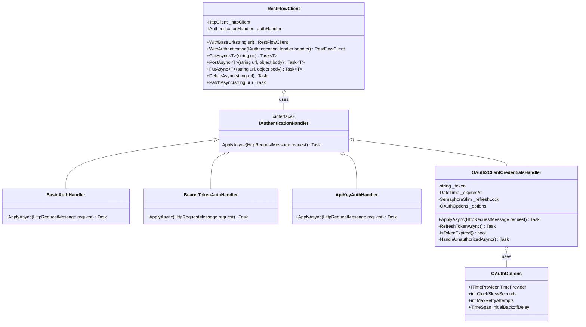
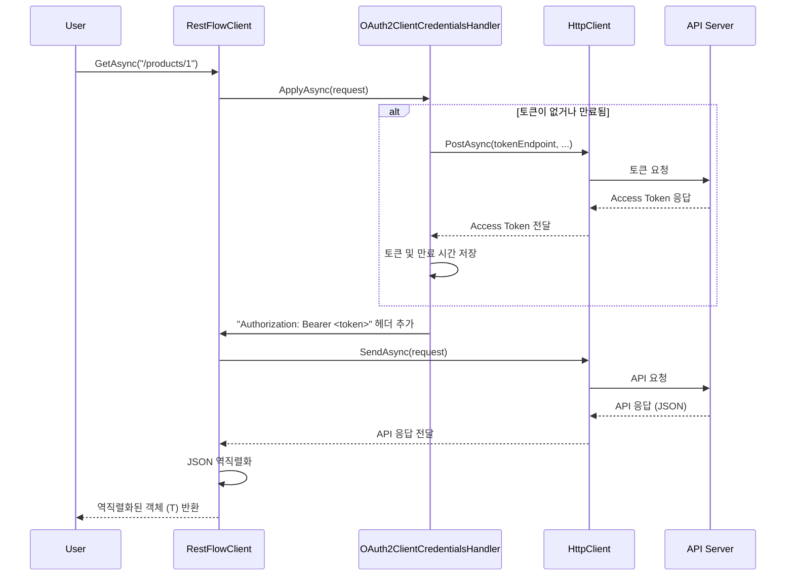
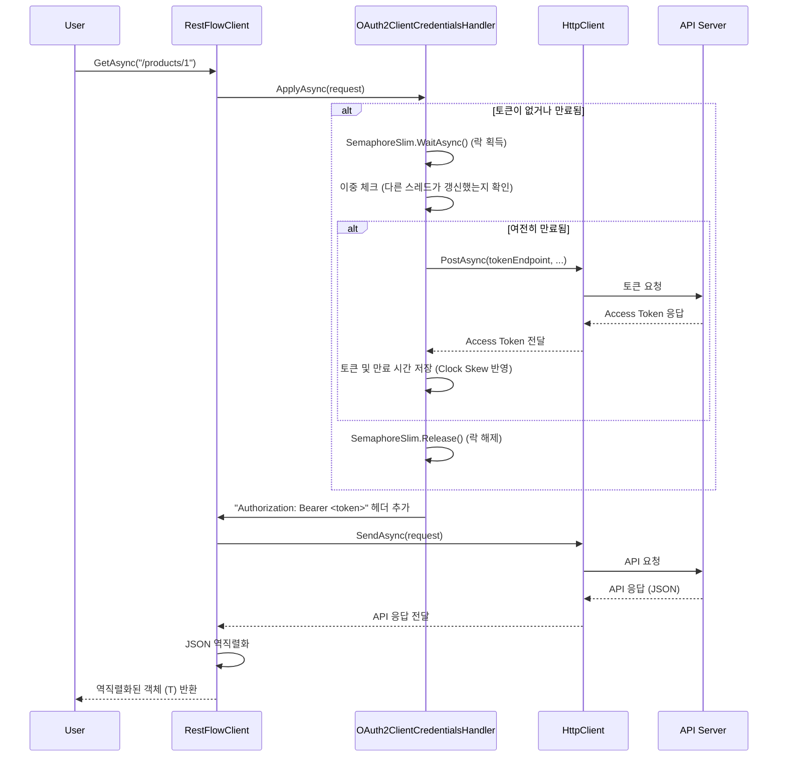
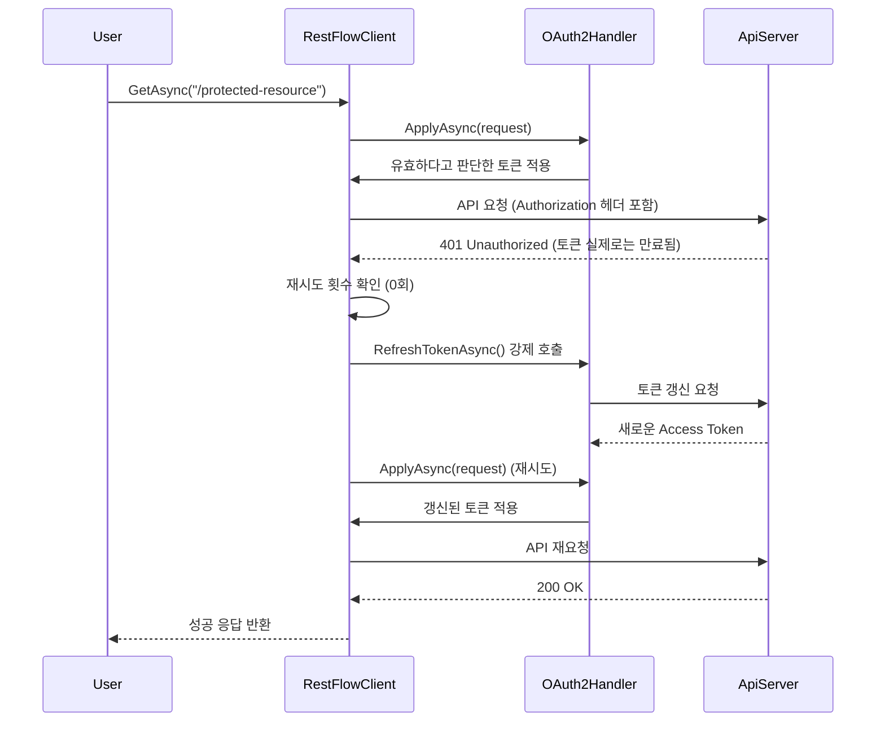

## 📋 RestFlow 라이브러리 아키텍처 설계

이 문서는 `PRD_RestFlow_요구명세서.md`를 기반으로 `RestFlow` 라이브러리의 기술 아키텍처를 정의합니다.

-----

### 1. 아키텍처 목표

*   **모듈성 및 확장성:** 새로운 인증 방식이나 기능을 쉽게 추가할 수 있는 구조를 지향합니다.
*   **코드 재사용성:** `RestFlow.Client10`과 `RestFlow.Client20` 간의 코드 중복을 최소화하여 유지보수 비용을 절감합니다.
*   **직관적인 API:** Fluent API 스타일을 채택하여 사용자가 라이브러리를 쉽고 명확하게 사용할 수 있도록 합니다.
*   **프레임워크 호환성:** 각 대상 프레임워크의 제약 사항을 명확히 분리하고, 환경에 맞는 최적의 구현을 제공합니다.

-----

### 2. 프로젝트 구조

솔루션은 다음과 같이 구성하여 코드 재사용성과 프레임워크별 종속성 관리를 최적화합니다.

```
RestFlow.sln
├── RestFlow.Shared/      (Shared Project)
│   ├── Handlers/
│   │   ├── Authentication/
│   │   │   ├── IAuthenticationHandler.cs
│   │   │   ├── BasicAuthHandler.cs
│   │   │   └── ... (다른 인증 핸들러)
│   ├── Models/
│   │   ├── ApiException.cs
│   │   └── ... (공통 모델)
│   └── RestFlowClient.Core.cs (핵심 로직 부분)
│
├── RestFlow.Client10/    (.NET Standard 1.0, .NET 4.5.2)
│   ├── RestFlowClient.cs (Shared Project 참조 및 래핑)
│   └── RestFlow.Client10.csproj
│
├── RestFlow.Client20/    (.NET Standard 2.0 이상)
│   ├── RestFlowClient.cs (Shared Project 참조 및 래핑)
├── RestFlow.Client20.csproj
│
├── RestFlow.Client10.Tests/ (xUnit 테스트 프로젝트, net452)
│   └── ...
│
├── RestFlow.Client20.Tests/ (xUnit 테스트 프로젝트, net461)
│   └── ...
│
├── RestFlow.Client10.TestApp.Wpf/ (WPF 테스트 앱, net452)
│   └── ...
│
└── RestFlow.Client20.TestApp.Wpf/ (WPF 테스트 앱, net461)
    └── ...
```

*   **`RestFlow.Shared` (공유 프로젝트):**
    *   `RestFlow.Client10`과 `RestFlow.Client20` 프로젝트가 공유하는 모든 핵심 로직을 포함합니다.
    *   인증 핸들러, 모델, 예외 클래스, Fluent API의 핵심 구현 등이 여기에 위치합니다.
    *   조건부 컴파일 지시문(`#if`)은 이 프로젝트 내에서 최소한으로 사용하여 프레임워크 간의 사소한 API 차이를 흡수합니다.
*   **`RestFlow.Client10` / `RestFlow.Client20`:**
    *   각각의 대상 프레임워크에 맞는 `.csproj` 파일을 가집니다.
    *   `RestFlow.Shared` 프로젝트를 참조하여 핵심 기능을 가져옵니다.
    *   주로 각 패키지의 진입점(Entry Point) 역할을 하는 `RestFlowClient` 클래스의 래퍼(Wrapper)를 포함할 수 있습니다.
*   **`RestFlow.Client10.Tests` / `RestFlow.Client20.Tests`:**
    *   각 라이브러리 프로젝트를 개별적으로 테스트하여 호환성을 검증합니다.
*   **`RestFlow.Client10.TestApp.Wpf` / `RestFlow.Client20.TestApp.Wpf`:**
    *   각 라이브러리 버전에 맞는 테스트 GUI 앱을 제공합니다.

-----

### 3. 핵심 클래스 및 인터페이스 설계 (UML)

#### 3.1. 주요 클래스 다이어그램



#### 3.2. 설계 설명

*   **`RestFlowClient`:**
    *   라이브러리의 메인 클래스이자 사용자의 주 상호작용 지점입니다.
    *   내부적으로 `HttpClient` 인스턴스를 관리합니다. (HttpClient의 올바른 사용 패턴을 위해 `static` 또는 `IHttpClientFactory`를 통한 관리를 고려해야 합니다.)
    *   `With...`로 시작하는 메서드 체이닝(Chaining)을 통해 설정을 구성하는 Fluent API를 제공합니다.
*   **`IAuthenticationHandler` (인증 전략 인터페이스):**
    *   **전략 패턴(Strategy Pattern)**을 적용하여 인증 로직을 캡슐화하고 분리합니다.
    *   `ApplyAsync` 메서드는 `HttpRequestMessage`를 받아 필요한 인증 헤더(예: `Authorization`)를 추가하는 역할을 합니다.
    *   이를 통해 `RestFlowClient`는 특정 인증 방식에 대한 구체적인 내용을 알 필요가 없어집니다.
*   **인증 핸들러 구현체 (예: `BasicAuthHandler`, `OAuth2ClientCredentialsHandler`):**
    *   각 인증 방식에 대한 구체적인 로직을 구현합니다.
    *   `OAuth2...` 핸들러들은 토큰 요청, 저장, 만료 확인 및 자동 갱신과 같은 상태 관리 로직을 내부에 포함합니다.

-----

### 5. 인증 핸들러 상세 설계

#### 5.1. OAuth 2.0 핸들러 구현 요구사항

OAuth 2.0 인증 핸들러는 프로덕션 환경에서의 안정성과 성능을 보장하기 위해 다음 사항을 반드시 고려해야 합니다.

##### 5.1.1. 토큰 캐싱 및 만료 관리

*   **Clock Skew 보정:**
    *   토큰 만료 시간(`expires_in`)에서 60~120초의 여유 시간(Clock Skew)을 차감하여 실제 만료 전에 미리 갱신합니다.
    *   이를 통해 네트워크 지연 및 서버 간 시간 불일치로 인한 인증 실패를 방지합니다.
    *   권장 기본값: `120초`

*   **동시성 제어 (Token Storm 방지):**
    *   다중 스레드 환경에서 여러 요청이 동시에 만료된 토큰을 감지할 경우, 토큰 갱신이 중복 실행될 수 있습니다.
    *   `SemaphoreSlim`을 사용한 락(Lock) 메커니즘으로 **단일 스레드만 토큰 갱신을 수행**하도록 보장합니다.
    *   이중 체크 패턴(Double-Check Locking):
        1.  락 획득 전: 토큰 만료 여부 확인
        2.  락 획득 후: 다시 한번 토큰 만료 여부 확인 (다른 스레드가 이미 갱신했을 수 있음)

##### 5.1.2. 401 Unauthorized 응답 처리

*   **만료 추정 실패 케이스:**
    *   Clock Skew 보정에도 불구하고, 서버 측 정책 변경이나 예기치 못한 상황으로 인해 유효하다고 판단한 토큰이 실제로는 만료되어 `401` 응답을 받을 수 있습니다.

*   **자동 재시도 정책:**
    *   `401 Unauthorized` 응답 수신 시, **1회에 한해** 즉시 토큰 갱신 후 동일한 요청을 재시도합니다.
    *   **무한 루프 방지:** 재시도는 요청당 1회로 제한하며, 2회 연속 `401` 발생 시 예외를 발생시킵니다.
    *   재시도 플래그(`X-RestFlow-Retry-Attempt`)를 내부 컨텍스트로 관리하여 재귀 호출을 추적합니다.

##### 5.1.3. 스레드 안전성 (Thread Safety)

*   **상태 변수 동기화:**
    *   `_token`, `_expiresAt`과 같은 공유 상태는 다중 스레드에서 안전하게 접근되어야 합니다.
    *   `SemaphoreSlim` 또는 `lock` 키워드를 사용하여 토큰 읽기/쓰기 작업을 동기화합니다.

*   **비동기 락 패턴:**
    *   `async/await` 환경에서는 `lock` 대신 `SemaphoreSlim.WaitAsync()`를 사용하여 데드락을 방지합니다.

##### 5.1.4. 토큰 응답 직렬화 유연성

*   **대소문자 및 네이밍 컨벤션 대응:**
    *   OAuth 2.0 토큰 엔드포인트는 서버마다 다른 응답 형식을 반환할 수 있습니다.
        *   `access_token` vs `accessToken`
        *   `expires_in` vs `expiresIn`
    *   `Newtonsoft.Json`의 `JsonSerializerSettings`에서 다음 옵션을 활성화합니다:
        ```csharp
        new JsonSerializerSettings
        {
            PropertyNameCaseInsensitive = true, // .NET Core 3.0+
            ContractResolver = new DefaultContractResolver
            {
                NamingStrategy = new SnakeCaseNamingStrategy() // 스네이크 케이스 지원
            }
        };
        ```

##### 5.1.5. 실패 처리 및 백오프(Backoff)

*   **지수 백오프(Exponential Backoff):**
    *   토큰 갱신 실패 시, 즉시 재시도하지 않고 점진적으로 대기 시간을 증가시킵니다.
    *   권장 정책: `초기 지연 = 1초`, 최대 재시도 횟수 = `3회`, 배율 = `2배`
        *   1차 실패 → 1초 대기 후 재시도
        *   2차 실패 → 2초 대기 후 재시도
        *   3차 실패 → 4초 대기 후 재시도
        *   이후 예외 발생

*   **실패 텔레메트리 훅:**
    *   인증 실패 이벤트를 외부 모니터링 시스템(예: Application Insights, Serilog)으로 전달할 수 있도록 이벤트 또는 콜백 메커니즘을 제공합니다.
    ```csharp
    public event EventHandler<AuthFailureEventArgs> OnAuthenticationFailure;
    ```

#### 5.2. OAuthOptions 클래스 도입

OAuth 관련 설정을 중앙 집중화하여 일관성 있게 관리합니다.

```csharp
public class OAuthOptions
{
    /// <summary>
    /// 시간 제공자 (테스트 시 Mocking 가능)
    /// </summary>
    public ITimeProvider TimeProvider { get; set; } = new SystemTimeProvider();

    /// <summary>
    /// Clock Skew 보정 시간 (초 단위, 기본값: 120초)
    /// </summary>
    public int ClockSkewSeconds { get; set; } = 120;

    /// <summary>
    /// 토큰 갱신 실패 시 최대 재시도 횟수 (기본값: 3회)
    /// </summary>
    public int MaxRetryAttempts { get; set; } = 3;

    /// <summary>
    /// 백오프 초기 지연 시간 (기본값: 1초)
    /// </summary>
    public TimeSpan InitialBackoffDelay { get; set; } = TimeSpan.FromSeconds(1);

    /// <summary>
    /// 401 응답 시 자동 재시도 활성화 여부 (기본값: true)
    /// </summary>
    public bool EnableAutoRetryOn401 { get; set; } = true;
}
```

**권장 사용 예시:**

```csharp
var client = new RestFlowClient()
    .WithOAuthClientCredentials(
        tokenEndpoint: "https://auth.example.com/token",
        clientId: "my-client",
        clientSecret: "my-secret",
        options: new OAuthOptions
        {
            ClockSkewSeconds = 90,
            MaxRetryAttempts = 5
        }
    );
```

-----

### 6. 주요 흐름 (Sequence Diagram)

#### 4.1. GET 요청 시퀀스 (OAuth 2.0 클라이언트 자격증명)



-----

### 6. 주요 흐름 (Sequence Diagram)

#### 6.1. GET 요청 시퀀스 (OAuth 2.0 클라이언트 자격증명 - 정상 흐름)



#### 6.2. 401 Unauthorized 재시도 흐름



-----

### 7. 기술적 결정

*   **직렬화:**
    *   `RestFlow.Client10`: `Newtonsoft.Json`을 필수로 사용합니다.
    *   `RestFlow.Client20`: `Newtonsoft.Json`을 필수로 사용합니다.
*   **오류 처리:**
    *   API 응답 상태 코드가 2xx가 아닐 경우, `ApiException` 예외를 발생시킵니다.
    *   `ApiException`에는 `StatusCode`, `Headers`, `ResponseBody` 등의 상세 정보를 포함하여 호출자가 오류를 디버깅하기 용이하게 만듭니다.
*   **HttpClient 관리:**
    *   `RestFlowClient` 인스턴스 생성 시 외부에서 `HttpClient`를 주입받을 수 있는 생성자를 제공하여, `IHttpClientFactory`와 같은 고급 DI 패턴과 통합될 수 있도록 합니다.


이 아키텍처는 요구사항을 만족시키면서 유연하고 확장 가능한 구조를 제공하는 것을 목표로 합니다.
